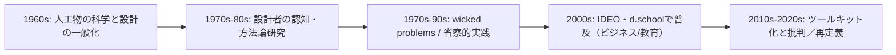

# デザイン思考の系譜と推論形式：アブダクション、フレーミング、そして形骸化批判

## 学習目標と調査設計

本調査で「必ず学ぶべきこと（3〜6項目）」を、最初に明示する。

- デザイン思考の「二重の系譜」：デザイン研究（designerly thinking／DesignThinking1）としての成立と、ビジネス向けツールキット（DesignThinking2）としての普及・変質。citeturn19search0turn2search48  
- wicked problems（厄介な問題）を扱う際に、デザイン思考が何をしているのか──「問題解決」より前段にある framing（問題設定・枠組み生成）を、一次・準一次資料に沿って特定する。citeturn0search3turn0search0  
- 「論理的思考」との厳密対比：deduction／induction／abduction（Peirce）を整理し、design thinking が本質的にどこに位置づくか（＝アブダクション＋フレーミングなのか）を検証する。citeturn10search0turn2search5  
- 方法論の形骸化（5段階プロセス化、共感ワークショップ化、ポストイット化、表層実装、評価不能化、innovation theater）を、学術・実務双方の批判から具体化し、再発防止の条件（「何が欠けると形骸化するか」）を抽出する。citeturn25view0turn14search0turn19search0turn2search48  
- 日本での受容（政策・大学教育）を、公式資料と大学の公開情報で確認し、輸入・翻訳時に生じやすい誤読（“型”の輸入）を整理する。citeturn20search0turn20search5turn20search6  

**使用したコネクタ一覧**  
- entity["organization","GitHub","code hosting platform"]（api_tool 経由で指定リポジトリを取得・精査）

**主要参照先リスト（優先順）**  
- 指定GitHubリポジトリ：entity["organization","uminomae/kesson-driven-thinking","github repository"]（後述の「欠損駆動思考」資料群。特に design thinking の5段階化・高速反復が失いがちな要素＝“Withhold/縁”の指摘を、内部一次情報として扱う）。fileciteturn22file0L1-L1 fileciteturn28file0L1-L1  
- 入口チェックリスト：entity["organization","Wikipedia","online encyclopedia"]（指定記事。論点の網羅性確認に使用し、主張の根拠は原則として一次・準一次へ差し戻す）。citeturn1view0  
- 一次・準一次：主要著者の著作・主要組織の公式資料（MIT Press、IDEO、d.school、Design Council など）と、査読論文（Design Studies 等）。citeturn6search2turn27search5turn2search0turn12search2turn2search5  

## エグゼクティブサマリ

使用LLMモデル: GPT-5.2 Thinking。デザイン思考は、もともと設計者の認知と実践を研究する「designerly thinking/DesignThinking1」として発達したが、2000年代以降、企業向けの「DesignThinking2」（ツールキット型）として急拡大し、意味のずれが混乱と批判を生んだ。学術側では、厄介な問題（wicked problems）を扱うためのフレーミング／再定義と、仮説生成としてのアブダクション（Peirce）—それを検証する演繹・帰納—の往還が中核と整理できる。一方、研修市場では5段階プロセス化や共感ワークショップ化により、問いの保持（withhold）、実装・評価が抜け落ち「innovation theater」に陥りやすい。本報告は指定GitHub（欠損駆動思考）が指摘する“急いで回すほど失うもの”も足場に、デザイン思考の本質を「アブダクション＋フレーミング＋素材との対話」に再定義し、その条件と限界を示す。citeturn19search0turn2search48turn2search5turn10search0turn25view0turn14search0 fileciteturn22file0L1-L1  

## 詳細版

**系譜（起源・歴史・二つの「デザイン思考」）**  
「デザインを“思考様式”として捉える」起点として、entity["people","ハーバート・A・サイモン","cognitive scientist"]の entity["book","The Sciences of the Artificial","simon 1969/1996"] が、人工物（artificial）を自然物（natural）と区別しつつ、人工システムの経験科学（science of the artificial/systems）が可能だとする枠組みを提示したことが、デザイン研究側の重要な根っこになった。citeturn6search2turn6search7turn8search1  
同書（1996年版の抜粋）に見える「Everyone designs…」の定義（＝現状から望ましい状態への変化のコースを案出する活動）も、設計・経営・政策へ “design” を拡張する長期的根拠として機能している。citeturn8search1  

次に、entity["people","ロバート・H・マッキム","design educator"]の視覚的思考の系譜や、entity["people","ピーター・G・ロウ","architectural theorist"]の entity["book","Design Thinking","rowe 1987"] が、建築・都市計画の設計行為を「探究の構造」として記述し、“design thinking” を設計実践の分析概念として定着させた。citeturn9search0turn5search0  

1970年代には、entity["people","ホルスト・W・J・リッテル","design theorist"]とentity["people","メルビン・M・ウェバー","urban planner"]が、社会計画上の問題が「定義できない／正誤判定できない／最適解が定義できない」などの性質を持つ “wicked problems” であることを論じ、デザインが扱う問題類型を強く特徴づけた。citeturn0search5turn0search4  
この “wicked problems” は、entity["people","リチャード・ブキャナン","design theorist"]が「デザイン思考における厄介な問題」としてデザイン研究領域へ再導入し、デザイン思考を「人間の困難な課題」を扱う枠組みとして位置づける上で重要な節点になった。citeturn0search0  

1980年代以降は、entity["people","ブライアン・ローソン","architectural researcher"]、entity["people","ナイジェル・クロス","design researcher"]、entity["people","ドナルド・A・ショーン","practice theorist"]が、設計者の認知・推論・熟達・省察をそれぞれ異なる角度から記述し、デザイン研究（DesignThinking1）を厚くした。citeturn5search2turn3search0turn4search2  

2000年代のビジネス領域では、entity["organization","IDEO","design consultancy"]や、スタンフォードのentity["organization","スタンフォード大学d.school","design institute stanford"]（創設者の一人としてentity["people","デビッド・ケリー","ideo founder"]）を中心に、デザイン思考が「人間中心のイノベーション手法」として普及した。citeturn6search4turn2search0turn27search0  
ただし近年、用語の意味は急速に変化し、design thinking の爆発的普及（特にビジネス・教育）と同時に、元来の「デザイナーの思考研究」と、企業向けの「ツールキット／レシピ」が分岐して混線していることが、当事者であるクロス自身によって整理されている。citeturn19search0  
同様に、ヨハンソン＝スコルドベリらは、デザイン領域の “designerly thinking” と、経営領域の “design thinking” を区別し、後者が（一般に）前者への参照が弱く、より表層的で累積的知識構築を妨げうる点を批判的に指摘する。citeturn2search48  

この「二つのデザイン思考」のずれは、指定GitHubリポジトリでも強く意識されている。同リポジトリは “欠損駆動思考” を基盤概念として提示し、デザイン思考（d.school等で流通する5ステップ）を参照しつつも、高速反復や“回し方”が失いがちな局面（問いの保持・関係生成）を別名で明示化しようとする。fileciteturn9file0L1-L1 fileciteturn22file0L1-L1  

この流れの「E（再定義）」に入ったこと自体は、2020年代の学術レビュー（組織文化との関係など）や、Design Studies の批判的論考（“design thinkingは何が起きたのか”）から読み取れる。citeturn12search0turn19search0  

**解決志向 vs 問題志向（Lawson）／分析と総合／発散・収束**  
ローソンの有名な実験（建築学生と理系大学院生に同一課題を与える）を入口にすると、理系側は「規則（問題構造）を発見するために探索を最大化」し、建築側は「成立しそうな解（境界条件を満たす配置）を早期に構成し、失敗すれば次の案へ」進む──という差異が描かれる（問題志向 vs 解決志向）。citeturn22view0  
ここから派生する含意は、「デザインは問題を完全定義してから解く」のではなく、**暫定的な解の構成（synthesis）を足場に、問題の再定義を含む探索を回す**ことが多い、という点である。クロスの “designerly ways of knowing” は、科学・人文学と並ぶ「第三の知（design）」を擁護しつつ、設計行為が独自の知の様式を持つことを論じている。citeturn3search0turn3search6  

発散／収束（divergent／convergent）は、研究系・普及系の双方で頻出するが、普及系の代表例としてentity["organization","Design Council","uk design body"]の “Double Diamond” がある。Double Diamond は、探索を広げ（divergent）→焦点化する（convergent）という二つのダイヤ（Discover/Define と Develop/Deliver）で設計プロセスを説明し、非デザイナーにも伝達しやすい形に図式化した。citeturn12search2  
指定GitHubリポジトリの「創造プロセス5段階」も、発散／収束を包含する位相として整理され、d.school の5ステップ（共感・定義・発想・プロトタイプ・テスト）との対応関係が表で示されている。fileciteturn22file0L1-L1  

**問題解決プロセスとしてのデザイン思考／原理（principles）**  
ビジネス普及系の典型定義は、ブラウン（IDEO）による「人のニーズ、技術可能性、事業成功要件を統合する」人間中心のイノベーション手法、というものだ（desirability、feasibility、viabilityの三要素で語られることが多い）。citeturn27search0turn27search4  
一方でIDEO自身は、「デザイン思考はステップ・バイ・ステップの唯一手法ではない」と明示し、成功事例には“絡み合うステップ”があり、反復を前提とすると述べる。citeturn27search5  
同様に d.school の Bootleg は、Empathize/Define/Ideate/Prototype/Test を「5つのmode（モード）」として提示しつつ、**“Start wherever you'd like”** として線形工程ではなく道具箱として位置づける。citeturn2search0  

ここから抽出できる「原理」は、少なくとも次の束として理解するのが安全である。  
- 人間中心（観察・共感・参加）  
- 問題設定（定義よりも“再定義・枠組み更新”を含む）  
- 外化（スケッチ、模型、プロトタイプ）と、それを介した対話  
- 反復（仮説→試作→検証→更新）

このうち特に外化と対話は、ショーンが設計を「状況との省察的対話」として捉え、設計者が“design world”を構成し、素材からの“back-talk”を受けるという描像と整合する。citeturn21search2turn4search2  

image_group{"layout":"carousel","aspect_ratio":"16:9","query":["Design Council Double Diamond diagram Discover Define Develop Deliver","Stanford d.school design thinking empathize define ideate prototype test diagram","IDEO design thinking desirability feasibility viability diagram"],"num_per_query":1}

**wicked problems（厄介な問題）と design thinking の射程**  
Rittel & Webber が提示した wicked problems の要旨は、(a)問題が確定できない、(b)解が「正解/不正解」ではなく「良い/悪い」評価になる、(c)最適解探索が成立しにくい、等であり、科学技術的な “tame problems” と対比される。citeturn0search5turn0search4  
ブキャナンは、デザイン思考がこの種の問題を扱う際に、工学的問題解決だけではなく、象徴・物・行為・システムといった複数レベルで“デザイン”が機能することを示し、デザイン思考を「人間の課題」を扱う一般理論へ拡張した。citeturn0search0  

このとき重要なのは、wicked problems においては「問題設定」それ自体が設計対象であり、問題の輪郭・評価軸・関係者・時間軸が更新され続ける点である。だから design thinking を「既知の問題を解く方法」として理解すると、射程を取り違える。citeturn25view0turn2search48  

**aha/insight（ひらめき）と、視覚アナロジー**  
デザイン実践では “ひらめき” が神秘化されやすいが、研究としては「突然の解（creative leap）」を記述モデルで再構成する試みがあり、洞察が“leap（跳躍）”というより“bridging（架橋）”として理解できる可能性が議論されている。citeturn26search3  
洞察（Aha!）一般についても、表象の再構成（restructuring）と主観的Aha体験を区別しつつ統合するレビューがあり、「突然に見えるが、背後では段階的プロセスが進む」という整理が主流である。citeturn26search0turn26search5  

視覚アナロジーは、設計の知的作業を支える代表的メカニズムで、経験研究としては、視覚アナロジーの利用が設計品質の改善に寄与し、とりわけ初心者に効果が大きい可能性が報告されている（教育への含意を含む）。citeturn21search1  

**科学／人文学との違い、デザインの言語**  
クロスの古典的主張は、design を science/humanities と並ぶ「第三の教育領域」として扱うべきだ、というものだが、裏側には「設計は、記号・形・機能・制約・価値を媒介する独自の言語ゲームを持つ」という含意がある。citeturn3search0turn3search6  
ショーン的に言えば、その“言語”は文章だけではなく、スケッチや模型、プロトタイプのような外化物を含む。これらは議論の対象であると同時に、議論を生成する装置でもある（＝素材が返す back-talk を聞く）。citeturn21search2turn4search2  

**論理的思考（deduction/induction/abduction）との対比**  
ここが本調査の中心論点である。  
entity["people","チャールズ・S・パース","pragmatist 1839-1914"]の整理（entity["organization","Stanford Encyclopedia of Philosophy","online philosophy reference"]の要約に従う）では、  
- **abduction**：驚くべき事実を説明する「説明仮説」を形成する段階（context of discovery）  
- **deduction**：仮説が真なら何が観察されるはずか、を導く段階  
- **induction**：観察・実験により仮説を（暫定的に）評価する段階  
が、探究の循環として位置づく。citeturn10search0turn10search1  

design thinking をこの枠にマッピングすると、「アイデア出し」や「発想法」だけでなく、**問題設定（framing）＝“何を驚きとみなすか／何を説明すべき事実として立てるか”**が、abduction の前提条件として見えてくる。この点を強く明示するのがドーストで、design thinking の核心を「推論パターンとしての abduction」と「framing/frame creation」として説明している。citeturn2search5turn2search3  
また、マーティンはビジネス領域で、デザイン思考を「信頼性（reliability）と妥当性（validity）の緊張を扱う」方法として語り、その中心ツールが abductive reasoning だと述べる。citeturn11search1turn11search2turn11search38  

この図は「デザイン思考＝アブダクション」ではなく、**アブダクションを中核に、演繹・帰納・フレーミング（再定義）を往還させる探究の運転**と理解した方が、一次資料（Peirce）とデザイン研究（Dorst）と、実務ガイド（IDEO/d.school）の双方に整合しやすい。citeturn10search0turn2search5turn27search5turn2search0  

**アブダクション（Peirce的）と design framing の関係評価**  
結論を先取りすると、design thinking は「Peirce的アブダクションに近い」が、**同一視**は危険である。理由は二つある。

第一に、Peirce の abduction は「説明仮説形成」として論理学的に定義されるが、design thinking の framing は、説明仮説だけでなく、価値判断（誰にとっての“望ましさ”か）、境界設定（どこまでを対象とするか）、評価軸（何が成功か）を含む。wicked problems ではこの価値・境界・評価軸の設計が不可避であり、ここが “論理” だけでは閉じない。citeturn0search5turn0search0turn2search5  

第二に、design thinking は「外化（プロトタイプ）」を通じて仮説を前進させる点で、言語命題の推論に還元しにくい。ショーンの “reflective conversation” は、この外化と相互作用を中心に据えることで、設計が単なる頭内推論ではないことを捉えようとする。citeturn21search2turn4search2  

したがって評価としては、  
- **近い**：design thinking の“新しい可能性を生む推論核”は abduction（仮説生成）に強く類似し、Dorst/Martin の整理とも合う。citeturn2search5turn11search1  
- **ただし拡張が必要**：design framing（枠組み生成）は、Peirce 的推論の外側（価値・境界・実践の素材性）まで含む拡張概念として理解する方が、wicked problems と実務の実態に整合する。citeturn0search5turn21search2  

---

**形骸化と批判（学術・実務）**  
ここでは、要請された「形骸化の具体例」を、（a）起こり方、（b）なぜ起きるか、（c）どの批判が当たっているか、で整理する。

- **五段階プロセス化（線形工程化）**  
  d.school の5モードや Double Diamond の図は、学習と共有言語には有効だが、線形工程として運用されると、問題再定義や反復の核心が抜け落ちる。d.school Bootleg 自体は「どこからでも始めてよい」として線形化を避けようとしている。citeturn2search0turn12search2  
  それでもなお、ビジネス領域で “cookbook（レシピ）” 的な実践になり、「デザイン思考は効かない」という苦情が出る構造を、クロスは“DesignThinking1/2の混線”として整理している。citeturn19search0  

- **共感ワークショップ化（共感＝儀式化）／ポストイット化**  
  近年の Design Studies 論文は、デザイン思考がコンサル商品として標準化され、トークン的に“採用されたふり”をされることで、元来のメリットが失われた、とかなり強い言葉で批判している。citeturn25view0  
  実務側批判としては、Jen のように「ポストイットや図形の儀式」「簡略化しすぎ」を問題にする議論が広く流通した（ただし論証強度は玉石混交）。ここは一次・査読側の批判（Cross、Kimbell、Johansson-Sköldberg 等）と分けて扱うのが安全である。citeturn19search0turn2search1turn2search48  

- **表層実装（ideationで止まり、実装・運用・評価が抜ける）**  
  “innovation theatre” へ接続する典型パターン。実証研究ベースの批判として、2025年の Design Studies 論文は、デザイン思考が「創造性のウォームアップ」としては役立つが、意味のあるイノベーションやシステム変化には不足しがちで、商業的な標準化が問題だと述べる。citeturn25view0  

- **評価不能化（成功条件が曖昧なまま流行語化）**  
  “何が成功か” が framing の一部として設計されないと、プロジェクトは「やった感」しか残らない。組織論レビューは、デザイン思考がツール導入として語られがちで、文化・制度（評価・意思決定・権限）へ埋め込まれないと機能しにくい論点を整理している。citeturn12search0  

- **innovation theater（目立つ活動だが成果が出ない）**  
  “innovation theater” という用語は、ブランクが HBR で、変化圧力下の大企業が目立つ施策を行うが実利に結びつかない状態として論じている。citeturn14search0  
  これは上記の「ideation止まり」「評価不能化」と相互補強し、デザイン思考の形骸化を“組織の免疫反応”として読む視点を与える。citeturn14search0turn12search0  

指定GitHubリポジトリは、この形骸化を別角度から言語化している。d.school 的5ステップを参照しつつ、「Define（問題定義）だけを急いで回すと、“解かずに保つ（Withhold）”や、関係が立ち上がる局面（縁）が欠落しうる」という趣旨の警戒が読み取れる。fileciteturn22file0L1-L1  
ここは学術の語彙で言えば、**framing（枠組み生成）を“工程”に押し込め、仮説の保持・再表象・評価設計を省略する**ことで起きる劣化、と解釈できる。citeturn2search5turn10search0turn25view0  

---

**左右対比表：本来のデザイン思考 vs 企業研修で流通する design thinking**  

| 観点 | 本来のデザイン思考（研究系/実務の熟達） | 企業研修で流通するdesign thinking（形骸化パターン） |
|---|---|---|
| 起点 | wickedな状況に対する問題設定・再設定（framing）を含む探究 citeturn0search5turn2search5 | 「課題は与えられている」前提で、解法生成のワークに短絡 citeturn19search0turn25view0 |
| 推論核 | abduction（仮説生成）＋反復（deduction/induction） citeturn10search0turn2search5turn11search1 | 5段階“工程”としての手順遵守（abductionの矮小化） citeturn19search0turn2search0 |
| 外化 | スケッチ/模型/試作＝思考の言語、back-talkを得る citeturn21search2turn4search2 | 付箋とテンプレで“可視化した気になる”（外化が議事録化） citeturn25view0turn13search5 |
| 共感 | 観察・参与・検証を含む「関係の設計」 citeturn12search2turn27search0 | “共感インタビュー”が儀式化し、意思決定に接続しない citeturn25view0turn12search0 |
| 実装 | 実装・運用・評価まで含む（組織制度も設計対象） citeturn12search0turn27search5 | ideation止まり／PoC止まりで本番実装・評価が抜ける citeturn25view0turn14search0 |
| 失敗の扱い | 反復の燃料（仮説更新） citeturn27search5turn10search0 | “失敗しないワークショップ”に最適化→学習が止まる citeturn25view0turn14search0 |

---

**deduction/induction/abduction/design framing の4象限比較表**  

| 区分 | 典型形式 | 生成するもの | 強み | 限界 | design thinking での位置 |
|---|---|---|---|---|---|
| Deduction（演繹） | ルール＋ケース→結論 | 予測、仕様、テスト条件 | 一貫性、再現性 | 新規アイデアは増えない citeturn10search0 | プロトタイプの評価設計、要件定義の整合に使う |
| Induction（帰納） | 事例→一般化 | 経験則、確率、評価 | 妥当性の裏づけ | 価値・境界は自動では決まらない citeturn10search1 | ユーザーテストや運用データで仮説を更新する |
| Abduction（アブダクション） | 驚き→説明仮説 | 仮説、概念、方向性 | 新規性（探索の起動） | 誤りやすい、検証が必要 citeturn10search0 | アイデア生成の核。ただし「説明仮説」に限定しない |
| Design framing（フレーミング） | 状況→枠組み構成 | 問い、境界、評価軸、価値命題 | wicked問題に対処可能 | 正当化には合意形成・制度が要る citeturn2search5turn0search5turn25view0 | design thinking の “前提生成” と “再定義” の中心（アブダクションを包含） |

---

**ビジネス/教育/日本の大学教育**  
ビジネス領域では、ブラウン（HBR 2008）系の定義が普及し、desirability/feasibility/viability の統合として語られる。citeturn27search4turn27search0  
教育領域では、d.school の Bootleg のような教材が、5モードを共有言語として提供している（ただし線形工程ではないことも明示される）。citeturn2search0  

日本では、政策的にはentity["organization","経済産業省","japan government ministry"]が「デザイン経営」宣言を含む資料を公開し、デザインを基軸とする人材育成を議論している。citeturn20search0turn20search7  
大学教育の例としては、entity["organization","東京大学 i.school","innovation education program"]が2009年開始のイノベーション教育プログラムとして、人間中心のアイデア創出プロセスに焦点を当てると説明している。citeturn20search5  
また、entity["organization","東京工業大学","university tokyo"]（当時）が d.school のワークショップを受け入れ、デザイン思考の5ステップを学ぶ場を設けた事例が公式記事として残る。citeturn20search6  

ここで注意すべきは、日本の導入局面では「研修メニュー（型）」が移植されやすく、**framing と組織実装（評価・意思決定・権限）**を伴わないと、innovation theater 的に終わるリスクが高い、という点である。これは政策文脈（人材育成・制度）と、学術レビュー（組織文化）と、Design Studies の批判的実証（標準化・商品化批判）が、別々の角度から同じ弱点を照らしている。citeturn20search7turn12search0turn25view0turn14search0  

**未確認点・限界（明示）**  
- McKim の著作は位置づけ上重要だが、本調査では一次テキスト本文への直接アクセスが限定的で、書誌・周辺情報中心になった（要追加確認）。citeturn9search4turn9search2  
- 「誰が “design thinking” を最初に命名したか」は文献上揺れがありうる。例えば Faste の貢献は財団記述等で確認できるが、厳密な初出（用語史）は別途書誌学的検証が必要（本調査は概念史重視）。citeturn4search0turn1view0  
- “研修で流通する design thinking” の実態は企業・業界により幅が大きい。本報告は、学術批判と代表的実務批判（HBR等）で「形骸化パターン」を抽出したもので、すべての研修が形骸化しているとは主張しない。citeturn14search0turn12search0turn19search0  

## 結論

- デザイン思考は「単一の手法」ではなく、研究系（designerly thinking）と普及系（ツールキット）に分岐しており、混線が批判と誤用を生む。citeturn2search48turn19search0  
- 厳密に言うと、デザイン思考の核は「Peirce的アブダクションそのもの」ではなく、**アブダクションを中核にしたフレーミングと反復探究（deduction/induction）**の運転である。citeturn10search0turn2search5turn27search5  
- wicked problems では「問題設定・評価軸・境界」が設計対象になるため、工程化した5ステップ理解は射程を取り違えやすい。citeturn0search5turn25view0  
- 形骸化は、(a)工程化、(b)共感の儀式化、(c)外化の議事録化、(d)実装・評価の欠落、(e)組織文化不整合、が重なると起きやすく、innovation theater と同型になる。citeturn12search0turn25view0turn14search0  
- これを避ける条件は、framing と評価設計（何をもって成功か）を初期から扱い、外化（プロトタイプ）を意思決定へ接続し、反復の学習を制度化すること。citeturn21search2turn27search5turn12search0  
- 指定GitHubリポジトリ（欠損駆動思考）は、design thinking の高速反復が失いがちな「問いの保持／関係が立つ局面」を明示化する試みとして読め、形骸化対策の“診断語彙”を提供している。fileciteturn22file0L1-L1 fileciteturn28file0L1-L1  
- 日本での普及は政策・大学教育にも及んでいるが、「型の輸入」だけでは成果が出にくい。制度設計（評価・意思決定・権限）まで含めた“組織のデザイン”が要る。citeturn20search0turn20search5turn12search0turn14search0  

## 参考文献

**指定GitHubリポジトリ（一次情報として扱った内部資料）**  
- uminomae/kesson-driven-thinking: README / docs / アーキテクチャ記述。fileciteturn8file0L1-L1 fileciteturn21file0L1-L1  
- 「創造プロセス5段階」および d.school 5ステップとの対応表（design thinking の“型”の扱いに関する内部批判を含む）。fileciteturn22file0L1-L1  
- design thinking をめぐる整理・比較（legacy evidence）。fileciteturn28file0L1-L1  
- designer向け reader-rules（方法論天井・チェックリスト化への注意喚起を含む）。fileciteturn29file0L1-L1  

**一次・準一次（原著・公式）**  
- Simon, H. A. *The Sciences of the Artificial* (MIT Press, 1969/1996). citeturn6search2turn8search1  
- （日本語で読める）サイモン『システムの科学 第3版』(稲葉元吉・吉原英樹訳、パーソナルメディア、1999)。citeturn23search1  
- Rowe, P. G. *Design Thinking*（MIT Press; 建築・都市計画の設計探究）。citeturn5search0  
- Lawson, B. *How Designers Think*（設計者の認知・問題/解解志向）。citeturn5search2turn5search5  
- Cross, N. “Designerly ways of knowing” (Design Studies, 1982). citeturn3search0turn3search6  
- Schön, D. A. *The Reflective Practitioner*（Basic Books, 1983）。citeturn4search2turn4search1  
- （日本語で読める）『省察的実践とは何か—プロフェッショナルの行為と思考』(監訳書誌情報)。citeturn23search4  
- Buchanan, R. “Wicked Problems in Design Thinking” (Design Issues, 1992). citeturn0search0turn0search2  
- Rittel, H. W. J. & Webber, M. M. “Dilemmas in a General Theory of Planning” (Policy Sciences, 1973). citeturn0search5turn0search4  
- Brown, T. “Design Thinking” (Harvard Business Review, 2008)／IDEO公式定義。citeturn27search1turn27search0  
- IDEO FAQ: “Design thinking is not a step-by-step process” の趣旨。citeturn27search5  
- d.school “Bootcamp Bootleg”（5モード、線形工程ではない）。citeturn2search0  
- Design Council “Framework for Innovation / Double Diamond”。citeturn12search2  

**学術レビュー・批判的整理（準一次〜二次）**  
- Dorst, K. “The core of ‘design thinking’ and its application” (Design Studies, 2011)：abduction と framing。citeturn2search5turn2search3  
- Kimbell, L. “Rethinking Design Thinking: Part I” (Design and Culture, 2011)：用語史と批判的整理。citeturn2search1turn2search4  
- Johansson‑Sköldberg, U. et al. “Design Thinking: Past, Present and Possible Futures” (2013)（designerly thinking と management discourse の分節）。citeturn2search48  
- Elsbach, K. D. & Stigliani, I. “Design Thinking and Organizational Culture” (Journal of Management, 2018)。citeturn12search0turn12search8  
- Cross, N. “Design thinking: What just happened?” (Design Studies, 2023)（二つのデザイン思考の混線と批判）。citeturn19search0  
- Bromage, M. et al. “From innovation theatre to systemic change…” (Design Studies, 2025)（標準化・商品化批判、実装不足）。citeturn25view0  

**推論形式（Peirce的アブダクション）**  
- Stanford Encyclopedia of Philosophy: “Peirce on Abduction”／Peirce項（abduction/deduction/induction の位置づけ）。citeturn10search0turn10search1  

**形骸化・innovation theater（実務側の代表）**  
- Blank, S. “Why Companies Do ‘Innovation Theater’…” (Harvard Business Review, 2019)。citeturn14search0  

**日本：政策・大学教育（公式）**  
- 経済産業省：高度デザイン人材育成研究会（参考資料として「デザイン経営」宣言PDFを提示）。citeturn20search0turn20search7  
- 東京大学 i.school（2009年開始、human-centeredなアイデア創出プロセスを学ぶ旨）。citeturn20search5  
- 東京工業大学（当時）公式：d.schoolワークショップ開催記録（5ステップ図を含む）。citeturn20search6  
- （日本語で読める重要文献）ブラウン『デザイン思考が世界を変える（アップデート版）』書誌（早川書房）。citeturn24search2turn24search4