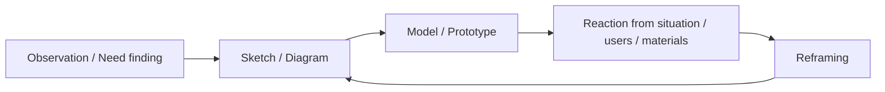

# visual thinking と language of design の深掘り

Issue: #11  
Parent: #6  
作成日: 2026-03-27  
作成: Codex  
使用モデル: `GPT-5`

## 0. エグゼクティブサマリー

design thinking の核を「よいアイデアを出す方法」とみなすと、なぜ sketch, model, prototype, arrangement, materials が重要なのかが見えなくなる。McKim, Buchanan, Schön を並べると、design における thinking は、言語化された reasoning の前後で起こるのではなく、むしろ表現・外化・試作・反応の循環の中で成立していることがわかる。Robert McKim の Stanford obituary は、彼の design approach を `visual thinking` と呼び、visualization, sketching, rapid prototyping を、drafting, writing, calculations より前景化する教育だったと説明する。また McKim 自身は、visual thinking は language の mindset から人を解き放つものだと述べていたと紹介される。[McKim obituary](https://engineering.stanford.edu/news/robert-mckim-force-stanfords-product-design-program-has-died)

Buchanan の 1992 年論文は、この問題を design communication と placements の理論に接続する。抽出した PDF テキストでは、participants 間の communication の basis を明確にしなければ、design thinking の foundations と value を理解する希望は乏しいとされる。さらに `Doctrine of Placements` では、design thinking を creative accidents の series 以上のものとみなすには、category と placement の差を理解することが essential だと述べられる。placement は固定的カテゴリーではなく、signs, things, actions, thoughts の間を動きながら invention を可能にする場所である。[Buchanan 1992 PDF](https://web.mit.edu/jrankin/www/engin_as_lib_art/Design_thinking.pdf) ここで重要なのは、表現は完成品の見た目ではなく、問題と解の空間を再配置する装置だという点である。

Schön はこの点を、`reflection-in-action` と `conversation with the situation` の語で支える。Google Books の書誌ページ自体は problem setting の全文を示さないが、少なくともこの本が engineering, architecture, management, psychotherapy, town planning の専門家が実際にどう問題解決するかを扱うことは確認できる。[Schön](https://books.google.com/books/about/The_Reflective_Practitioner.html?id=ceJIWay4-jgC) Schön の設計理解では、図や模型や試作は完成案の前段階にある補助物ではなく、状況に問いを返し、設計者の framing を変える相手である。したがって design の language とは、単なる verbal description ではなく、図像、配置、素材、モデル、振る舞いを含む representational ecology だと言うべきである。

この視点から見ると、workshop 化で design thinking の核が抜けやすい理由も明確になる。business design thinking が teachable / portable になる過程では、外化の媒体が sticky notes, canvases, low-fidelity prototypes といった簡易な装置へ圧縮される。これ自体が悪いわけではないが、表現が knowledge-generating medium でなく facilitation prop に変わると、visual thinking の核心は薄くなる。残るのは「書き出すこと」だが、失われるのは「表現の変化が思考を変えること」である。だから design thinking を守るべき点は、ポストイットの有無ではなく、artifact が situation との対話を可能にしているかどうかである。

## 1. 何を見たいか

本メモの問いは三つである。

1. design における `visual thinking` は何を意味するか。  
2. `language of design` は verbal language とどう違うか。  
3. なぜ workshop 化でこの核が抜けやすいのか。  

## 2. McKim: visual thinking は言語の代替ではなく認知の拡張

### 2.1 Stanford 公式記事の整理

- [McKim obituary](https://engineering.stanford.edu/news/robert-mckim-force-stanfords-product-design-program-has-died) は、McKim を visual thinking の創始者として扱う。
- 記事では、McKim が `visualization, sketching, and rapid prototyping` を drafting, writing, calculations より重視したと説明される。
- need finding, idea sketching, ambidextrous thinking, abductive reasoning といった演習名も挙げられている。
- Kelley は *Experiences in Visual Thinking* を `the beating heart of the Stanford design project methodology` と呼び、学生の `power of perception` を鍛えるために使うと述べている。

### 2.2 含意

- visual thinking は「絵で考えると楽しい」という話ではない。
- それは perception を訓練し、言語が固定しがちな見方をずらし、 tentative forms を通じて問題理解そのものを動かす実践である。
- McKim 系譜では、 sketch は記録ではなく探索装置である。

## 3. Buchanan: design の language は placements と communication

### 3.1 communication among participants

- Buchanan PDF の抽出テキストでは、participants 間の communication の basis を明確にしなければ、design thinking の foundations と value を理解できないとされる。
- ここで communication は会話の円滑化だけでなく、design objects を通じた意味共有を含む。

### 3.2 doctrine of placements

- Buchanan は `Doctrine of Placements` を提示し、category と placement の区別を essential とする。
- 抽出テキストでは、design thinking を creative accidents の series 以上のものとみなすには、この distinction が必要だと述べる。
- また placements は signs, things, actions, thoughts の間を動き、design thinking の dimensions を reconsideration of problems and solutions によって発見する `places of invention` とされる。

### 3.3 含意

- language of design とは、固定意味を持つカテゴリーの列挙ではない。
- それは problems と solutions の再配置を可能にする representational field である。
- 図、モデル、インタラクション、サービス場面、物理配置はすべて language の一部になる。

## 4. Schön: conversation with the situation

### 4.1 書誌レベルで確認できること

- [The Reflective Practitioner](https://books.google.com/books/about/The_Reflective_Practitioner.html?id=ceJIWay4-jgC) は、engineering, architecture, management, psychotherapy, town planning の professionals が実際にはどう問題解決するかを扱う。
- Schön の広く知られた論点は problem setting, reflection-in-action, conversation with the situation にある。

### 4.2 design への含意

- 設計者は表現したものを「見る」ことで考えを修正する。
- situation は無言の素材ではなく、 sketch, model, prototype に応答する相手になる。
- この往復の中で framing が更新される。

### 4.3 McKim / Buchanan との接続

- McKim は perception と visual externalization を強調した。
- Buchanan は placements と communication を理論化した。
- Schön はその往復が reflective conversation だと捉えた。
- 三者を合わせると、design thinking は表現の外側で完結する思考ではなく、表現によって進む思考だと言える。

## 5. artifact を通じた思考

- sketch は idea の写しではなく、まだ曖昧な関係を仮置きする
- prototype は feasibility check だけでなく、認識を更新する
- reaction は評価結果であると同時に、新しい問いの発生源でもある
- reframing は頭の中だけでなく、artifact を見返すことで起こる

## 6. なぜ workshop 化で核が抜けやすいか

### 6.1 外化の簡易化

- business DT は短時間で共有可能な artifact を必要とする
- そのため sticky notes, canvases, low-fi props が中心になる

### 6.2 artifact の機能変化

- 本来の artifact:
  knowledge-generating medium
- workshop artifact:
  facilitation prop

### 6.3 失われやすいもの

- perceptual discipline
- representational precision
- material resistance から学ぶこと
- form-giving に伴う judgment

### 6.4 残りうる核

- 外化の必要性
- 対話の媒介としての artifact
- making through learning

## 7. 比較表

| 観点 | visual / designerly side | workshopized DT side |
|---|---|---|
| artifact の役割 | 思考を進める媒体 | 協働を進める道具 |
| sketch の意味 | perception と framing の探索 | アイデアのメモ |
| prototype の意味 | situation と対話する装置 | 検証用 deliverable |
| language | signs, things, actions, thoughts の配置 | verbal summaries + sticky notes |
| リスク | tacit すぎて伝わりにくい | 表現の厚みが消える |

## 8. 結論

1. visual thinking は、言語を捨てることではなく、言語だけでは固定されがちな見方を外化によって動かす実践である。  
2. design の language は verbal language だけでなく、sketch, model, prototype, arrangement, material response を含む。  
3. Buchanan の placements 論は、design representation を invention の場として理解するうえで重要である。  
4. Schön の reflection-in-action は、artifact を通じた situation との対話として読むのが妥当である。  
5. workshop 化で design thinking の核が抜けるのは、artifact が knowledge-generating medium から facilitation prop に変わるからである。  
6. したがって守るべき本質は「付箋を使うこと」ではなく、「表現が framing を変えていること」である。  
7. design thinking の非言語的・物質的側面を失うと、残るのは ideas の列挙であって、design の思考ではなくなる。  

## 9. 重要文献・資料

- Stanford Engineering, “Robert McKim, a force in Stanford’s product design program, has died.” [Stanford](https://engineering.stanford.edu/news/robert-mckim-force-stanfords-product-design-program-has-died)  
  visual thinking, perception, need finding, rapid prototyping の Stanford 公式整理。

- Richard Buchanan, “Wicked Problems in Design Thinking” (1992). [MIT-hosted PDF](https://web.mit.edu/jrankin/www/engin_as_lib_art/Design_thinking.pdf)  
  communication, placements, categories vs placements の設計理論。

- Donald A. Schön, *The Reflective Practitioner* (1984). [Google Books](https://books.google.com/books/about/The_Reflective_Practitioner.html?id=ceJIWay4-jgC)  
  reflection-in-action / professional problem solving の書誌導線。

- [design-thinking-stanford-lineage-deep-dive-codex-20260327.md](/Users/uminomae/dev/project-design/knowledge/research/design-thinking/design-thinking-stanford-lineage-deep-dive-codex-20260327.md)  
  McKim → Kelley → d.school / IDEO の系譜整理。

- [design-thinking-designerly-vs-business-deep-dive-codex-20260327.md](/Users/uminomae/dev/project-design/knowledge/research/design-thinking/design-thinking-designerly-vs-business-deep-dive-codex-20260327.md)  
  workshop 化で失われるものの比較整理。

## 10. 未確認・保持論点

- Schön の problem setting / conversation with the situation の本文ページ自体は今回直接確認していない。
- Buchanan PDF は text extraction ベースで読んでいるため、版面文脈の精密確認は今後の余地がある。
- design methods 系の representation 論をさらに厚くするなら、Goel や Krippendorff も追加候補になる。
