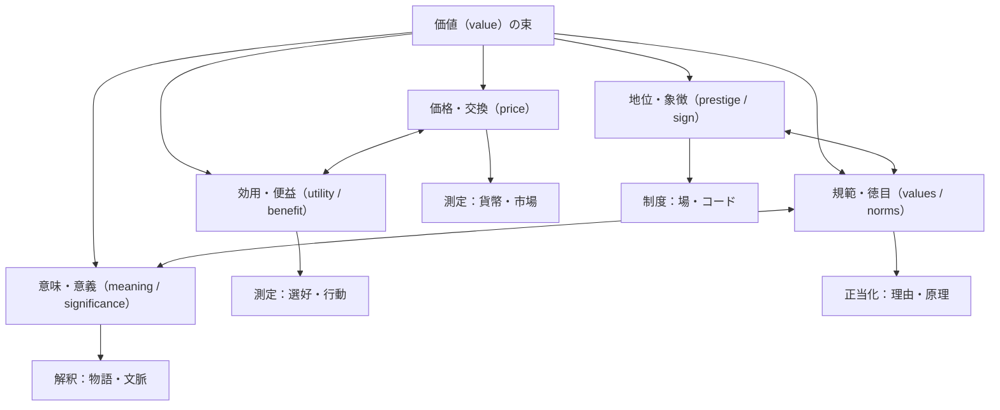

使用モデル: GPT-5.2 Thinking

# 価値という語の全体像

## Executive summary

（出力形式A：全体要約）

「価値」は、単に「値段（価格）」の同義語ではなく、①交換・配分をめぐる“市場的な価値”（price / market value）、②目的達成や満足をめぐる“効用・便益”（utility）、③善悪・正不正をめぐる“規範的な価値”（values / moral value）、④意味・重要性をめぐる“意義”（significance / importance）、⑤地位・名誉・象徴性をめぐる“社会的価値”（prestige / symbolic value）など、異なる問題系が束になった多義語です。日本語辞書でも「価値」は「主体の欲求との関係で成立する満足可能性」といった主観的・関係的側面を含む一方、経済学的には「商品の使用価値・交換価値」など複数の概念的区別を含むことが示されます。citeturn5view0

英語圏では、この束がより細かく分節されやすく、たとえば **value** は「金銭的価値」から「重要性」まで広く覆う一方、複数形 **values** は「（道徳的・文化的）信念・規準」の意味に強く寄ります。entity["organization","Cambridge Dictionary","english dictionary website"] でも value は「金銭的価値／重要性・worth」を含み、values は「何が正しいか・何が重要かに関する信念」を指す用法が前面に出ます。citeturn9search0turn9search1　この分節の差が、日本語「価値／価値観／値打ち／意義／価格」などを英語に寄せる際の「ズレ（誤解）」を生みやすい、というのが全体像の要点です。citeturn22view1turn22view2turn22view0

さらに、概念史的には「価値」は近代の経済・哲学・社会科学で中心概念化され、価値の“種類”（内在的／道具的、主観／客観、個人／社会など）や、価値を“どう扱うか”（発見か付与か、測定可能か、比較可能か）が争点化してきました。これは哲学の価値論（価値理論）で整理され、内在的価値（intrinsic value）と道具的価値（instrumental value）の区別などが入口になります。entity["organization","Stanford Encyclopedia of Philosophy","philosophy encyclopedia online"] citeturn0search11turn0search15　また、漢字構成（「価」「値」）自体が「値段」と「値打ち」を橋渡ししており、日本語「価値」が価格・評価・徳目・意味へと滑らかに拡張されやすい下地になっている、という見立ても成立します（この点は字義からの推論であり、概念史の厳密な確証は個別検討が必要です）。citeturn24search0turn24search3

## 用語マップ

（出力形式B：日本語⇄英語対応表）

| 英語 | 典型的な日本語対応 | 短い定義（使い分けの核） | ニュアンス差・翻訳注意 |
|---|---|---|---|
| value | 価値／価値（評価）／（数学の）値 | 金銭的価値・重要性・有用性など広域（名詞／動詞 “重視する” も）。citeturn9search0turn9search2 | 日本語「価値」は“価値観”まで含めて言いがちだが、英語は values に逃がすことが多い。citeturn9search1turn22view1 |
| values | 価値観／価値体系／信条 | 行動を方向づける信念・規準（moral/traditional values 等）。citeturn9search1 | 「価値が高い」ではなく「（何を大切にするかの）価値観」。単数 value と混同しやすい。citeturn9search1turn22view1 |
| worth | 値打ち／価値／（自己の）尊厳・自己価値 | 価格に見合う／それだけの価値がある（worth it）、または“人の価値（self-worth）”。citeturn9search4turn9search12turn9search3 | 価値判断の「割に合う／報われる」感が強い。日本語「価値がある」は文脈次第で worth/valuable に分岐。citeturn9search3turn22view2 |
| merit | 長所／功績／（議論の）見るべき点 | 賞賛に値する点・美点（scientific merit 等）。citeturn23search12turn9search5 | 日本語「メリット」は利得寄りだが、英語 merit は「正当性」「功績」「学術的価値」も含む。citeturn23search12turn9search5 |
| utility | 有用性／効用 | 一般に “usefulness”。経済学では選好の表現としての効用（utility function）を指標化。citeturn9search0turn35view0turn23search3 | 「効用」は心理的快楽に限らず“選好順序の表現”で、心理学的実体とは別物になりうる。citeturn35view0 |
| significance | 意義／重要性／（統計）有意性 | 元来「意味」。転じて重要性（importance）。citeturn23search4 | “statistical significance” は「統計的有意性」になり、日常の「重要性」とズレる。語源的にも「意味→重要性」の拡張。citeturn23search4 |
| importance | 重要性 | 重要である度合い（比較的ストレート）。 | value と違い、金銭評価・徳目評価まで含みにくい（文脈で value に寄る）。citeturn9search0 |
| price | 価格／値段 | 価値の貨幣的表現（価値概念の違いで価格規定が変わる）。citeturn22view0 | 日本語「価格」は「価値を貨幣で表したもの」と定義されやすく、価値との区別を要請する。citeturn22view0 |
| valuation | 評価／値付け／（理論）価値評価 | 価値を見積もる行為・手続（測定・推定・正当化を含むことが多い）。 | 「価値（value）」と「評価（valuation）」を区別しないと、議論が“対象”と“操作”で混線する（立場による）。citeturn22view2turn44view0 |

補足：日本語側では「価値観」は「評価の基準として何にどう価値を認めるか」という定義が明示されます。citeturn22view1　また「値打ち」は「その物事がもっている価値／値段」両義を持ち、“worth” 的用法と接続しやすい語です。citeturn22view2

## 領域別の見取り図

（出力形式C：領域別一覧。各領域について「何が価値か／どう測るか／典型的問い」を简潔に）

下表は「価値」の問いを、**価値の対象（何が価値か）**・**価値化の手続（どう測るか）**・**典型的問い（何を問うか）**に分解して配置したものです。領域ごとの“価値”は同名でも、対象と測定手続が異なるため、翻訳や学際議論ではまずこの分解が有効です（方法論的整理）。citeturn0search11turn22view0turn44view0

| 領域 | 何が価値か（価値の対象） | どう測るか（指標・手続） | 典型的問い | 代表資料（例） |
|---|---|---|---|---|
| 経済学（古典派・新古典派・労働価値説・効用など） | 財・サービス・労働・交換の関係、希少性、満足（効用）、制度的条件。citeturn5view0turn22view0 | 価格・相対価格、効用最大化モデル（utility function による選好表現）、厚生基準（パレート等）など。citeturn35view0turn22view0turn6search1 | 「価値」と「価格」は同じか／分離できるか。使用価値と交換価値の区別は何を説明するか。効用は“心理量”か“表現装置”か。citeturn6search1turn35view0turn5view0 | citeturn6search1turn35view0turn22view0turn5view0 |
| 経営・マーケティング | 顧客にとっての便益−コスト、差別化、ブランド資産、公共価値等。citeturn10search0turn27view1turn11search2 | 顧客価値（便益とコスト差）、ブランドエクイティ、価値提案（value proposition）設計など。citeturn10search0turn27view1turn11search2 | 価値は“提供物の属性”か“顧客側の経験・評価”か。組織はどう価値を創造・捕捉（appropriation）するか。citeturn27view1turn11search2 | entity["company","McKinsey & Company","management consulting firm"] citeturn11search2turn27view1turn10search0 |
| 倫理学・哲学（価値論） | 善・正・徳、内在的価値／道具的価値、価値判断の正当化。citeturn0search11turn0search15 | 論証（理由づけ）、反省的均衡、直観・原理・帰結の整合、価値のタイプ分け。citeturn0search11turn0search15 | 価値は主観か客観か。価値は発見されるのか付与されるのか。内在的価値とは何か。citeturn0search15turn0search11turn15search3 | entity["organization","Encyclopaedia Britannica","encyclopedia publisher"] citeturn0search9turn0search11turn0search15 |
| 芸術・美学 | 美・崇高・表現・芸術性、審美経験が生む価値（aesthetic value）。citeturn40search1turn40search0turn40search4 | 批評・解釈・共同体の規準、審美判断（taste/judgment）の普遍妥当性要求の分析など。citeturn40search0turn40search13 | 審美価値は快に還元できるか。美的判断はどこまで “普遍性” を主張できるか。citeturn40search0turn40search1turn40search13 | citeturn40search0turn40search1turn40search4 |
| 社会学 | 社会的評価（名声・地位）、資本（経済／文化／社会／象徴）としての価値、制度が生む尺度。citeturn27view2turn27view3 | 規範・制度・ネットワーク分析、場（field）と尺度の生成史（どんな“価値尺度”が支配的か）。citeturn27view2turn27view3 | 何が“価値あるもの”として認可されるのか（正統化）。価値尺度は誰が作り、誰に有利か。citeturn27view2turn27view3 | citeturn27view2turn27view3 |
| 文化人類学 | 贈与・交換・儀礼に埋め込まれた価値（物の価値＋関係の価値）。citeturn29view0turn29view1 | 参与観察、交換儀礼の機能分析（義務・互酬・名誉）。citeturn29view1 | なぜ贈与は“自由な好意”ではなく義務（与える／受け取る／返礼）として組織されるのか。citeturn29view0turn29view1 | citeturn29view0turn29view1 |
| 宗教学・思想史 | “究極の価値”（救済・聖・戒律）や共同体の意味秩序。価値が欲求や規範と結びつく領域。citeturn5view0turn21search0 | 聖典解釈、倫理規範の系譜、儀礼実践の分析。 | 価値の根拠（神／理性／伝統）はどのように権威化されるか。生活の意味と価値は同一か。citeturn21search0turn5view0 | citeturn21search0turn5view0 |
| 法学・政治学 | 憲法的価値（尊厳・自由・平等等）、人権、公共の正当化原理。citeturn18search0turn18search1turn18search5 | 権利審査・比例原則・正当化、制度設計、公共価値の評価。citeturn18search0turn18search4turn18search7 | 価値の衝突（自由 vs 安全など）をどう調整するか。国家はどの価値を代表できるか。citeturn18search0turn18search1 | entity["organization","European Union","political union Europe"] entity["organization","United Nations","intergovernmental org"] citeturn18search0turn18search1turn18search2 |
| 教育学 | 道徳的価値・市民的価値、学習者が形成する価値観、態度・価値の育成。citeturn31view0turn33view0turn22view1 | カリキュラム（道徳科等）、学習成果（attitudes/values）枠組み、評価（形成的評価）。citeturn31view0turn33view0 | “特定の価値の押し付け”を避けつつ、価値判断能力をどう育てるか。citeturn31view0turn22view1 | entity["organization","OECD","intergovernmental org Paris"] entity["organization","文部科学省","Japan education ministry"] citeturn31view0turn33view0 |
| 情報学・AI・HCI | 人間の価値（values）を技術設計に組み込む：価値整合（alignment）、価値配慮設計など。citeturn27view0turn12search1turn44view0 | 目的関数／報酬設計、選好学習、ステークホルダー分析、価値のトレードオフ設計。citeturn27view0turn12search1turn44view0 | 価値を“仕様”として記述できるか。価値が複数で衝突する時、誰の価値を優先するか。citeturn44view0turn12search1turn27view0 | citeturn44view0turn12search1turn27view0 |
| 認知科学・認知心理学（簡潔） | 選択・注意・学習を方向づける主観的価値（報酬・努力・将来価値など）。citeturn13search10turn14search0 | 行動指標（選好・反応時間）、モデル（期待効用／プロスペクト理論など）。citeturn14search0turn13search10 | “価値”は状況でどう歪むか（損失回避等）。価値は共通通貨か（比較可能性）。citeturn14search0turn13search10 | citeturn14search0turn13search10 |
| 神経科学・神経現象学（入口のみ） | 主観報告と脳ダイナミクスを往復し、価値・意味づけを含む経験を扱う。citeturn39view0turn13search11 | 価値関連ネットワーク等の神経指標＋訓練された一人称データ（neurophenomenology）。citeturn39view0turn13search11 | 一人称データを“科学データ”としてどう統合するか（偏り・介入・説明ギャップ）。citeturn39view0 | citeturn39view0turn13search11 |
| 臨床心理・精神分析 | 症状の背後にある価値・信念・規範（超自我、恥・罪責等）、治療目標としての価値。 | 面接・ナラティブ分析、機能分析、（立場により）無意識的価値葛藤の解釈。 | “価値”は治療で明示化すべきか／されるべきか。価値の衝突が苦悩をどう生むか（立場による）。citeturn14search10turn21search0 | citeturn14search10turn21search0 |
| 人間性心理学 | 成長・自己実現・意味（meaningfulness）に結びつく価値。citeturn21search0turn20search2 | 価値明確化、ライフレビュー、自己報告尺度など（方法は学派で多様）。 | “よい人生”の次元として幸福・道徳・意味はどう関係するか。citeturn21search0turn21search9 | citeturn21search0turn21search9turn20search2 |
| 環境倫理・生態学 | 自然の多様な価値（利用価値・文化的価値・内在的価値）と、人間福祉との関係。citeturn37view0turn15search3turn15search5 | 生態系サービス（benefits）、多元的評価（valuation）、倫理的議論（内在的価値）。citeturn37view0turn15search5turn15search3 | “価値”は貨幣換算できるか。自然の内在的価値を政策にどう反映するか。citeturn37view0turn15search3turn15search5 | entity["organization","Millennium Ecosystem Assessment","UN ecosystem assessment"] entity["organization","IPBES","biodiversity science-policy panel"] citeturn37view0turn15search5turn15search3 |
| メディア・消費文化 | 物の機能・需要だけでなく、記号・威信・差異化が生む価値（sign value）。citeturn42view0turn42view1 | 記号体系分析、広告・ブランド・プラットフォームの政治経済。 | 消費は“個人の欲求満足”か“社会的機能（威信・階層）”か。価値はどこで生成されるか。citeturn42view0turn42view1 | citeturn42view0turn42view1 |

### 領域をまたぐ「価値」関係図（概念の束のほどき方）

この図は、「価値」を一つの“実体”として扱うのではなく、**どの次元（価格／効用／規範／意味／象徴）を議論しているか**をまず固定し、次に**測定（measurement）か正当化（justification）か解釈（interpretation）か**という“操作の種類”を区別することが学際的混線を避ける、という提案です。価値と事実の混同回避（facts/values の区別）や、価値を設計に持ち込む際の方法論（VSD 等）とも整合します。citeturn44view0turn0search11turn22view0

## 領域横断の論点

（出力形式D：比較表）

| 論点軸 | 両極（単純化） | 争点の中身 | “ズレ”が起きやすい接点（例） | 代表資料（例） |
|---|---|---|---|---|
| 客観性 vs 主観性 | 客観的価値（事物に備わる） vs 主観的価値（欲求・選好に依存） | 価値を“世界の性質”とみなすか、“関係（評価者×対象×文脈）”とみなすか。citeturn0search15turn5view0 | 「価値がある」は客観記述に見えるが、英語だと “valuable to whom?” が立ち上がりやすい。citeturn9search0turn5view0 | citeturn0search15turn5view0turn9search0 |
| 発見 vs 付与 | “ある”価値を発見 vs 人間が価値を付与 | 規範の根拠（実在論・構成主義等）と、評価行為（valuation）の位置づけ。立場による。citeturn0search11turn44view0 | AI設計で「価値を入れる」は“付与”に見えやすいが、倫理学では“発見”立場もある。citeturn44view0turn0search11 | citeturn0search11turn44view0 |
| 価値 vs 価格 | 価値＝価格 vs 価値≠価格 | 価格は価値の貨幣表現だが、価値概念が違えば価格規定も変わる（理論依存）。citeturn22view0turn5view0 | 翻訳で value を一律「価値」とすると price と混線しやすい。citeturn22view0turn9search0 | citeturn22view0turn9search0turn5view0 |
| 価値 vs 意味 | 価値は“よさ”／意味は“理解” | 意味（meaning）は記述・解釈の軸、価値（value）は選好・称賛・規範の軸。ただし両者は絡み合う（例：人生の意味）。citeturn21search0turn23search4 | “significance” は「重要性」と「意味」の両方を含み、日本語「意義」も揺れる。citeturn23search4 | citeturn21search0turn23search4 |
| 評価（valuation） vs 価値（value） | 測る行為 vs 測られると想定される対象 | 価値は“実体”ではなく、測定・正当化・比較の手続が価値の姿を形作る（立場による）。citeturn44view0turn22view2 | 「価値＝測定値」と誤解すると、倫理・美学の議論が“数値化”へ不必要に吸い寄せられる。citeturn0search11turn44view0 | citeturn44view0turn0search11 |
| 個人 vs 社会 | 個人の選好・幸福 vs 社会の規範・制度 | 価値の主体（誰の価値か）と、権威（誰が決めるか）が衝突する領域。citeturn18search0turn33view0 | 憲法的価値（社会的合意）と個人の価値観のズレ、教育での価値形成など。citeturn18search0turn31view0turn33view0 | citeturn18search0turn31view0turn33view0 |
| 複数価値のトレードオフ | 単一尺度で最適化 vs 多元的・不可通約 | 価値はしばしば複数で衝突し、単一尺度化（貨幣・効用・スコア）に抵抗する。citeturn37view0turn44view0turn33view0 | 生態系サービス評価（貨幣化の利点と限界）や、AI目的関数設計での“仕様化できない価値”。citeturn37view0turn27view0turn15search5 | citeturn37view0turn27view0turn15search5turn44view0 |

## 日本語と英語のズレと翻訳での誤解パターン

日本語「価値」は、日常語でも学術語でも守備範囲が広く、**価格・値打ち・重要性・意義・規範・価値観**を一語で往復しがちです。対して英語では、（同じ value という語が広域であるにもかかわらず）**values（信念・規範）**、**price（値段）**、**worth（割に合う／自己価値）**、**merit（美点・功績）**、**utility（有用性／効用）**などに“逃がす”ことで、論点の型が早めに分かれやすい、というズレがあります。citeturn9search0turn9search1turn22view1turn22view0

誤解が起きやすい典型は、**value（単数）と values（複数）**の混同です。たとえば “our values” は多くの場合「私たちの価値（価格）」ではなく「私たちの価値観／信条」です。citeturn9search1turn22view1　逆に日本語の「価値が高い」は、英語では **high price**（価格が高い）なのか **high value**（重要度・便益が高い）なのか、あるいは **valuable**（価値がある）なのかが文脈で分岐します。citeturn22view0turn9search0

第二に、**「価値がある」＝ worth it / worthwhile** のズレがあります。英語の worth it は「努力や費用に見合う（割に合う）」ニュアンスが強く、日本語の「価値がある（倫理的に価値がある／学問的に価値がある）」の一部は **merit**（学術的価値・見るべき点）や **valuable/important** に逃がしたほうが自然な場合があります。citeturn9search3turn23search12turn9search0

第三に、学術文脈固有のズレとして、**utility（効用）**があります。日常語の utility は “usefulness” 寄りですが、経済学では「選好を数で表す」道具として定義され、心理的実体としての快楽と同一視しない立場も標準的です（効用関数は選好順序を表現する写像、という定式化）。citeturn35view0turn23search3　この点は、経済学→認知科学／神経科学へ橋を架けるときに「効用＝脳内快楽量」と誤読しやすいポイントです（立場と研究系譜による）。citeturn13search10turn14search0

最後に、価値の「概念史入口」として、日本語側では「価値」や「価格」の初出例が近代の対訳文献（英和辞書的文脈）で示されることがあり、西洋語（value/price 等）との接触・翻訳が語の近代的用法の形成に関わった可能性が示唆されます（ただし、これだけで“翻訳語として創出された”と断定するには不足）。citeturn5view0turn22view0

## 深掘り候補と主要参考文献

（出力形式E：深掘り候補10項目。神経現象学・認知科学と他領域をつなぐ論点を優先）

- 価値の「測定」と「正当化」の分岐：同じ“価値”が、経済学では測定（価格・効用）へ、倫理学では正当化（理由）へ傾くときに何が起きるか。citeturn22view0turn0search11turn44view0  
- 「価値整合（alignment）」は倫理学の価値論を必要とするのか：目的関数に落とす前に、価値の種類・衝突・不可通約性をどう扱うか。citeturn27view0turn12search1turn0search11  
- 価値の社会的生成：制度・場・コードが価値尺度を作るという視点を、AI評価指標・ランキング文化に接続する。citeturn27view2turn42view1turn44view0  
- 贈与の価値とデジタル経済：互酬・義務・名誉が、オンラインコミュニティ／クリエイター経済の「価値」にどう現れるか。citeturn29view1turn42view1  
- 生態系サービスと内在的価値の二重記述：貨幣評価の実用性と、自然の内在的価値の主張をどう両立させるか。citeturn37view0turn15search3turn15search5  
- 「価値観教育」と多元主義：特定の価値観の押し付け回避と、公共的価値の共有（尊厳・人権等）の両立。citeturn31view0turn33view0turn18search1  
- 審美価値と規範：美的判断の“普遍妥当性要求”が、倫理・政治の価値対立理解に与える示唆。citeturn40search13turn40search0turn0search11  
- 「意味（meaning）」と「価値（value）」の関係：人生の意味の議論が、価値論・幸福論とどう分岐／接続するか。citeturn21search0turn21search9turn0search11  
- 神経現象学の方法論的射程：一人称データを“価値経験”の研究に使う際、偏り・介入・説明ギャップをどう扱うか。citeturn39view0turn13search11  
- 「価値の語彙」そのものの比較言語学：価値・値打ち・意義・有意性・メリットなど、日本語内部の分節と英語の分節が、思考習慣にどう影響するか（未確認／研究設計が必要）。citeturn22view2turn23search4turn9search1  

参考文献候補（主要）

- entity["organization","コトバンク","japanese dictionary portal"]「価値」「価値観」「価格」「値打ち」各項（デジタル大辞泉／精選版日本国語大辞典等の定義参照）。citeturn5view0turn22view1turn22view0turn22view2  
- entity["organization","Stanford Encyclopedia of Philosophy","philosophy encyclopedia online"]：Value Theory／Intrinsic vs. Extrinsic Value／Environmental Ethics／Aesthetic Judgment／Beauty／The Meaning of Life（概念整理の一次入口）。citeturn0search11turn0search15turn15search3turn40search0turn40search1turn21search0  
- entity["organization","Cambridge Dictionary","english dictionary website"]：value／values／worth（英語側の基本分節）。citeturn9search0turn9search1turn9search4turn9search3  
- entity["organization","Online Etymology Dictionary","etymology website"]：value／worth／utility／significance／price（語源と意味拡張の入口）。citeturn0search16turn0search17turn23search3turn23search4turn23search1  
- entity["organization","Encyclopaedia Britannica","encyclopedia publisher"]：Axiology（価値論の概説入口）。citeturn0search9  
- 価値を“設計に入れる”ための枠組み：Value Sensitive Design（価値＝金銭価値に限らない定義、fact/value 区別、設計方法論）。citeturn44view0  
- 価値整合（value alignment）の技術的定式化：CIRL（Cooperative Inverse Reinforcement Learning）と、その問題設定。citeturn12search1turn27view0  
- 教育における価値：道徳科解説（道徳的価値・価値観の扱い）／OECD Learning Compass 2030（attitudes and values の定義と分類）。citeturn31view0turn33view0  
- 環境の価値：Millennium Ecosystem Assessment（ecosystem services／intrinsic value の併置）／IPBES Values Assessment。citeturn37view0turn15search5  
- 消費文化の価値：記号・威信・象徴交換価値をめぐる議論（sign value など）。citeturn42view0turn42view1